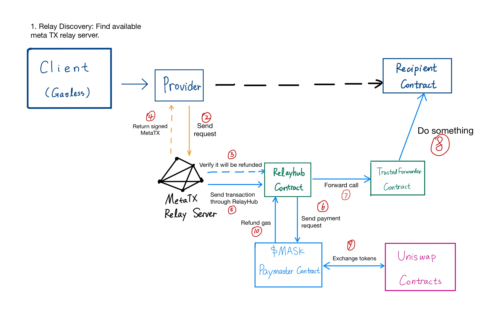
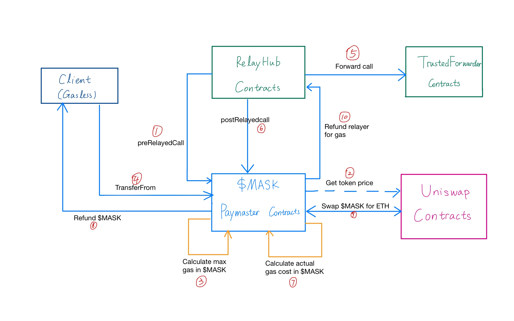

# Workflow

## Workflow of entire system

The above is a diagram which could describe the overall workflow of our demo.

- Client needs to sign & send a meta transaction to relay server.
- As stated in the [official doc of GSN](https://docs.opengsn.org/#architecture):

> The best practice is for every dapp to deploy their own relay servers that will provide service at-cost to its own users and charge a transaction fee for serving the users of other dapps.

- **Relay Discovery**: If our own relay servers are unavailable, the client will fallback to routing transactions through the third-party relay server (which could be the relay server of other dapps).

- Relay server will call corresponding view function in `RelayHub` to check if the gas fee will be refunded to it from our paymaster contract.

- RelayHub will send payment request to `Paymaster` and `Paymaster` will deal with the gas fee payment logistics. You can check the detail of how our `Paymaster` solve the payment problem [here](#workflow-of-paymaster).

- Finally, `RelayHub` will forward call to `TrustedForwarder` and complete the call to recipient call.

## Workflow of Paymaster

As described in [GSN DOC](https://docs.opengsn.org/contracts/#paying-for-your-user-s-meta-transaction):

> Unlike regular contract function calls, each relayed call has an **additional number of steps it must go through**, which are functions of the `Paymaster` interface that RelayHub will call before and after calling your contract.

- `RelayHub` should call `preRelayedCall()` in `Paymaster` before it sends real call request:

  - `Paymaster` call uniswap contract to get the current exchange price for pair: `MASK-ETH`.
  - `Paymaster` call the `calculateCharge()` in `RelayHub` to get the max possible gas that needs to pay in $ETH.
  - `Paymaster` calculate the amount of $MASK to pay max possible gas fee that needs to be charged by client.
  - `Paymaster` call `transferFrom()` to transfer the specific amount of $MASK from client to `Paymaster`.

- `RelayHub` forward call to `TrustedForwarder`.
- `RelayHub` should call `postRelayedCall()` in `Paymaster` after it sends call request:

  - `Paymaster` call the `calculateCharge()` in `RelayHub` to get the actual gas that needs to pay in $ETH.
  - `Paymaster` call uniswap contract to get the current exchange price for pair: `MASK-ETH`.
  - `Paymaster` calculate the amount of $MASK to pay actual gas fee that needs to be charged by client.
  - Then, `Paymaster` refund unused $MASK to client.
  - `Paymaster` interact with Uniswap contracts to swap $MASK for $ETH and then, refund relayHub in $ETH.
